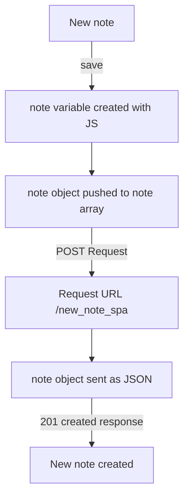

<h1>FSO exercise 0.6</h1>
<h4>New note in Single page app diagram:</h4>

```mermaid
flowchart TB;
A[New note] -- save--> B[note variable created with JS]
B --> C[note object pushed to note array]
C -- POST Request --> D[Request URL /new_note_spa]
D --> E[note object sent as JSON]
E -- 201 created response --> F[New note created]
```
